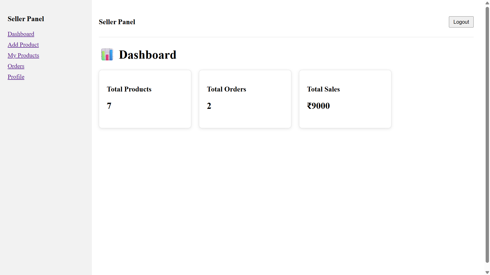
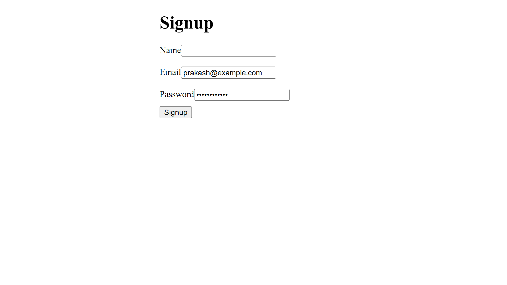
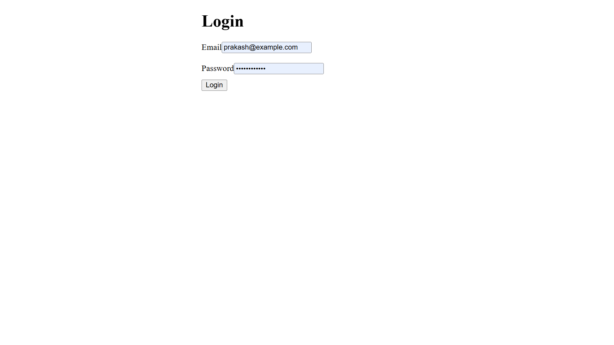
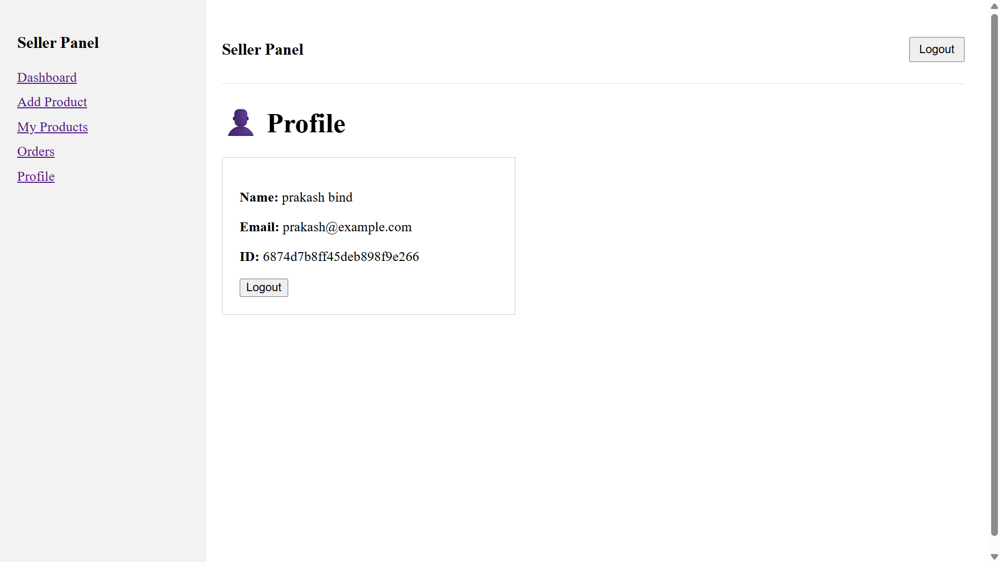
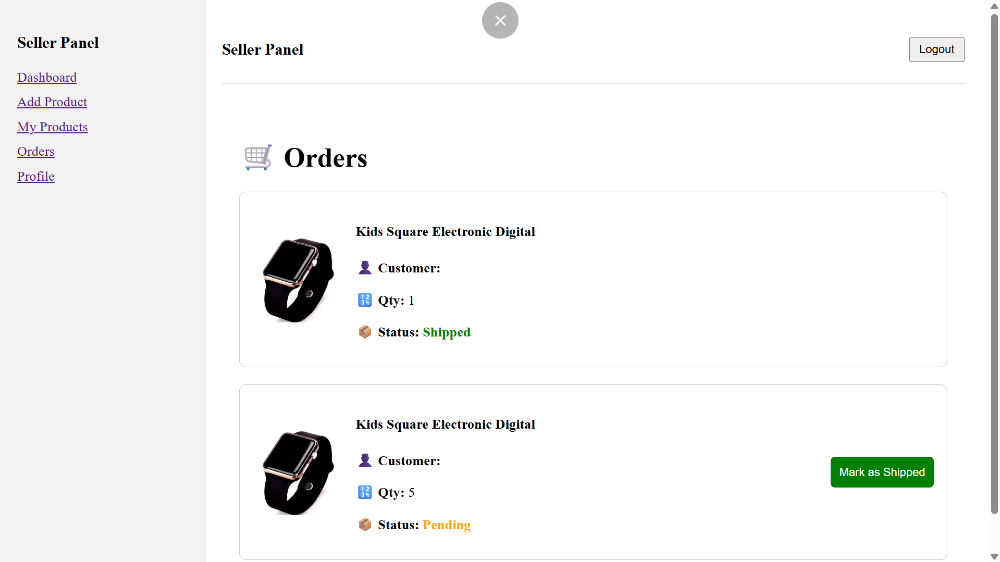
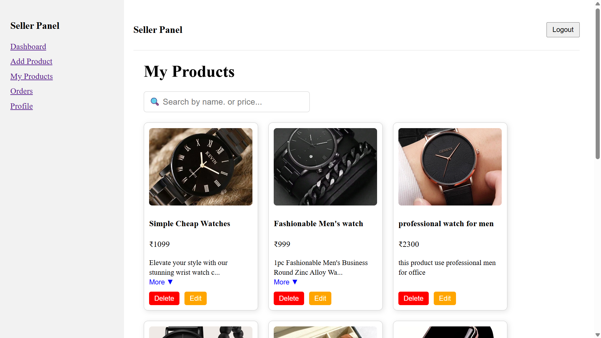
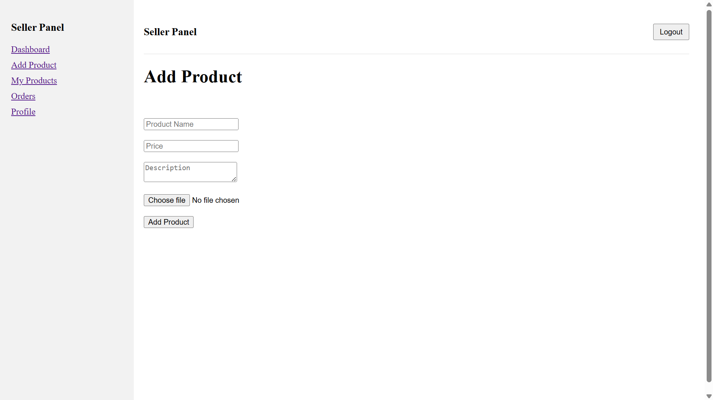
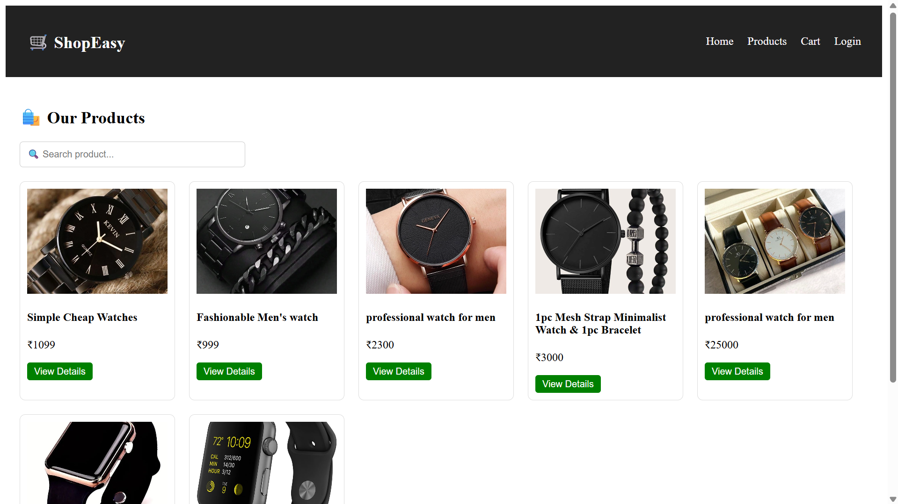
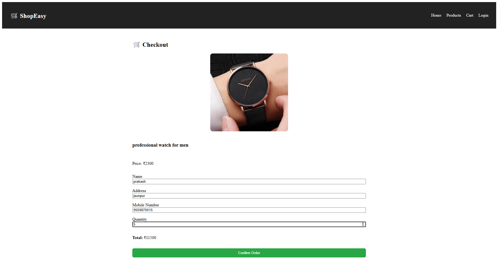
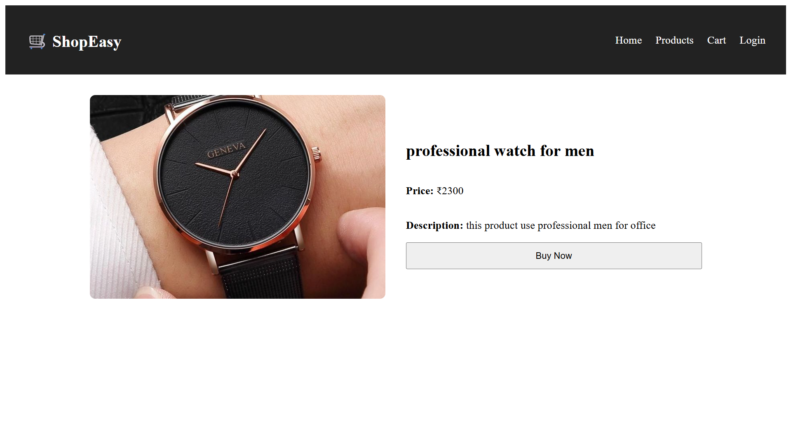

# MERN-Ecommerce-App
Full Stack E-Commerce web application built with React, Node.js, Express, and MongoDB. Includes buyer storefront, seller dashboard, admin panel integration.

## 🚧 Project Status
- Backend ✅
- Seller Dashboard ✅
- Buyer Frontend 🛠️ In Progress


## 🚧 Project Status

| Module            | Status          | Description                                  |
|-------------------|-----------------|----------------------------------------------|
| Backend API       | ✅ Complete     | Node.js + Express + MongoDB + JWT Auth       |
| Seller Dashboard  | ✅ Complete     | Product management, orders                   |
| Buyer Frontend    | 🛠️ In Progress  | Home, Product List, Cart, Checkout           |

---

## 💡 Features

- 🔐 JWT Authentication for Sellers
- 📦 Product CRUD APIs
- 🛍️ Order Management
- 📊 Seller Dashboard UI
- 🧾 RESTful API Architecture
- 💾 MongoDB Atlas Integration
- 🌐 Responsive Design (Using normal CSS)

---

## 📦 Tech Stack

- **Frontend**: React.js, Normal CSS
- **Backend**: Node.js, Express.js
- **Database**: MongoDB Atlas
- **Auth**: JSON Web Tokens (JWT)
- **Deployment**: Coming soon...

---

## 📸 Screenshots

### 🧑‍💼 Seller Pages








### 🛍️ Buyer Pages





---

## 📂 Setup Instructions

```bash
# Backend
cd backend
npm install express mongoose cors dotenv multer body-parser nodemon jsonwebtoken etc.
npm start

# Seller Frontend
cd seller-frontend
npm install axios react-router-dom formik yup etc.
npm run dev

# Buyer Frontend (Coming Soon)
cd buyer-frontend
npm install axios react-router-dom formik yup etc.
npm run dev
